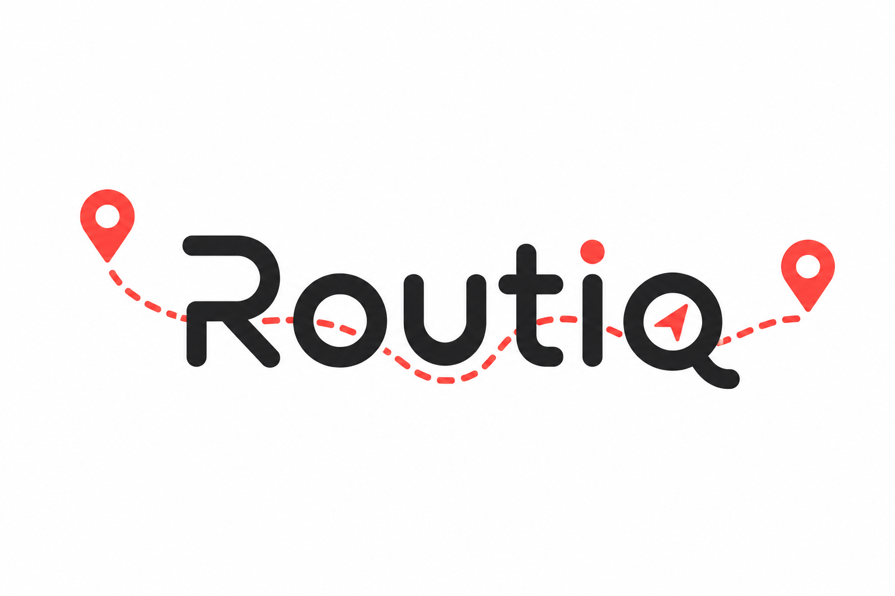
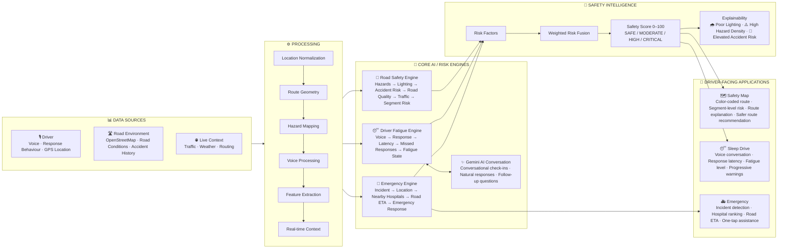

# Routiq 🚗



Built by Team Deoncodes

Routiq is a road-safety intelligence platform that helps drivers understand route risk, detect fatigue early, and respond faster during emergencies.

It combines three core layers:
- safety-aware routing
- conversational driver fatigue monitoring
- emergency response assistance

---

## Why this exists

Most navigation tools optimize for travel time. Routiq optimizes for safety and decision support.

Instead of only showing a route, it helps users answer:
- Is this route safe?
- Why is it risky?
- Is the driver getting fatigued?
- What should happen if an emergency occurs?

---

## What it does

### 1. Explainable route safety
- Scores routes by risk level
- Breaks down route safety segment by segment
- Highlights high-risk corridors, junctions, and blackspots
- Shows the reason behind a risky section instead of just a number

### 2. Sleep Drive
- Tracks conversational response patterns
- Measures response latency and engagement quality
- Estimates fatigue state from interaction signals
- Escalates warnings progressively instead of reacting to one event alone

### 3. Emergency response workflow
- Uses live GPS context
- Finds nearby hospitals dynamically
- Ranks them based on driving ETA
- Shows a route to the best available option
- Helps accelerate emergency response procedures

---

## Architecture


This keeps the app split into clean concerns:
- frontend for interaction and UI
- backend for logic and orchestration
- data-driven safety and routing intelligence behind the API

---

## Tech stack

### Frontend
- React
- TypeScript
- Vite
- Tailwind CSS

### Backend
- Python
- FastAPI
- Pydantic

### Intelligence layer
- route safety scoring
- fatigue monitoring logic
- emergency decision support
- external AI / voice services when enabled

> The project is designed around core product functionality, not around exposing the underlying third-party resource stack in the user-facing docs.

---

## Project structure

```text
Routiq/
├── frontend/
│   ├── src/
│   ├── public/
│   ├── package.json
│   └── vite.config.ts
├── backend/
│   ├── app/
│   ├── tests/
│   ├── requirements.txt
│   └── .env.example
├── README.md
├── QUICK_START.md
├── TROUBLESHOOTING.md
└── ...
```

---

## Quick start

### 1. Backend

```bash
cd backend
python -m venv venv
# Windows
venv\Scripts\activate
# macOS / Linux
# source venv/bin/activate
pip install -r requirements.txt
uvicorn app.main:app --reload --port 8000
```

### 2. Frontend

```bash
cd frontend
npm install
npm run dev
```

### 3. Local environment

Frontend:

```env
VITE_API_URL=http://localhost:8000
```

Production:

```env
VITE_API_URL=https://routiq-o2j2.onrender.com
```

---

## Deployment notes

- Backend is intended to run as a FastAPI service
- Frontend can be deployed separately to Vercel or similar hosting
- Set the frontend environment value to the deployed backend URL when shipping

---

## Demo flow

1. Open the app and select a route
2. View segment-wise safety risk on the map
3. Start Sleep Drive and observe conversational fatigue signals
4. Trigger the emergency flow
5. Review nearby hospital options and route guidance

---

## Team

Built by Team Deoncodes

Part of the Devfolio Hackathon

---

## License

Project-specific license terms can be added here if required by the hackathon or team usage policy.

# 🧭 Design Philosophy

RoadSafe is built around three principles:

### Predict

Identify road and driver risk before an accident occurs.

### Prevent

Use conversational engagement and safer route recommendations to reduce risk.

### Respond

When prevention isn't enough, provide immediate, actionable emergency assistance.

---

# 🏆 Why RoadSafe?

Most navigation systems optimize for:

> **Fastest route.**

Most driver-monitoring systems ask:

> **Are your eyes open?**

RoadSafe asks:

> **Is this route safe, is the driver okay, and what should happen next?**

That is the core idea behind RoadSafe AI.

---

## ⚠️ Disclaimer

RoadSafe AI is a **prototype made for learning**.

Safety scores, fatigue states, route ETAs, and emergency detection are estimates and should not be treated as guaranteed predictions, medical diagnoses, or guaranteed emergency-service dispatch.

Drivers should always prioritize safe driving and stop in a safe location when fatigued.

---

## 👥 Built For

**Learning**

Built with AI, maps, real-time data, and human-centered safety design.
